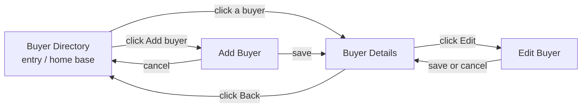

# District Wheels Dispatch Directory

## Wireframes and Component Breakdown

**Purpose:** Help the fulfillment manager find a repeat buyer and copy saved shipping information into LBC or J&T Express.

**Primary user:** District Wheels fulfillment manager.

**Primary task:** Search for a buyer, choose the correct shipping method and saved location, then copy courier-ready values.

---

## 1. Screen Map



| Screen | Purpose | Main navigation |
| --- | --- | --- |
| Buyer Directory | Search by partial buyer name or phone number | Open Buyer Details; open Add Buyer |
| Buyer Details | Review the buyer and copy shipping values | Return to Directory; open Edit Buyer |
| Add Buyer | Create a buyer and initial shipping location | Save to Buyer Details; cancel to Directory |
| Edit Buyer | Update buyer details and saved locations | Save or cancel to Buyer Details |

There are no dead ends. Buyer Directory is the entry point and home base.

---

## 2. Box Sketches at Two Widths

### Screen 1: Buyer Directory

**Desktop**

```text
+------------------------------------------------------------------+
| [District Wheels]  Buyer Directory                  [+ Add buyer]|
+------------------------------------------------------------------+
| BUYER DIRECTORY                         [10 buyers]              |
| Find a repeat buyer by name or phone                             |
| [ Search: buyer name or phone number                ] [ Search ] |
+----------------------------------------------+-------------------+
| SEARCH RESULTS                               | EMPTY / HELP      |
| [Buyer name] [Phone] [Courier] [Open ->]     | [message]         |
| [Buyer name] [Phone] [Courier] [Open ->]     | [Clear search]    |
| [Buyer name] [Phone] [Courier] [Open ->]     +-------------------+
| [Buyer name] [Phone] [Courier] [Open ->]     | QUICK TASK        |
| [Showing 1-4]                       [<] [>]  | [+ Add buyer]     |
+----------------------------------------------+-------------------+
```

**Phone - what stacks**

```text
+----------------------------+
| [DW]                [Menu] |
+----------------------------+
| BUYER DIRECTORY            |
| Find by name or phone      |
| [+ Add buyer]              |
| [Search field]             |
| [Search]                   |
|                            |
| SEARCH RESULTS             |
| [Buyer name]      [Open ->]|
| [Phone]                    |
| [Courier]                  |
| [Buyer name]      [Open ->]|
| [Phone]                    |
| [Courier]                  |
| [1-3 of 10]        [<] [>] |
+----------------------------+
```

The header collapses to a menu, the Add action moves below the heading, and each result row becomes a stacked card.

### Screen 2: Buyer Details

**Desktop**

```text
+--------------------------------------------------------------------------+
| [District Wheels]                            [<- Buyer Directory]        |
+--------------------------------------------------------------------------+
| Directory / Buyer Details                                                |
| [Buyer name]                                      [Edit] [Delete]        |
+------------------------------------------------+-------------------------+
| CONTACT                                        | SAVED ADDRESSES         |
| Buyer name [value] [Copy]                      | (o) Default address     |
| Phone       [value] [Copy]                     | ( ) Other address       |
|                                                | [+ Add]                 |
| SHIPPING DETAILS                               +-------------------------+
| Method: [Door to Door] [Branch Pickup]         | LBC PICKUP LOCATIONS    |
| Recipient name  [value] [Copy]                 | (o) Default branch      |
| Recipient phone [value] [Copy]                 | [+ Add]                 |
| Street          [value] [Copy]                 +-------------------------+
| Barangay        [value] [Copy]                 | LOADING / ERROR / EMPTY |
| City             [value] [Copy]                | [message / retry]       |
| Province         [value] [Copy]                |                         |
| ZIP code         [value] [Copy]                |                         |
| [Copy full address] [Copy all shipping details]|                         |
+------------------------------------------------+-------------------------+
```

**Phone - what stacks**

```text
+------------------------------+
| [DW]           [<- Directory]|
+------------------------------+
| [Buyer name]                 |
| Preferred: [Courier]         |
| [Edit] [Delete]              |
|                              |
| CONTACT                      |
| Name  [value]        [Copy]  |
| Phone [value]        [Copy]  |
|                              |
| SHIPPING METHOD              |
| [Door] [Pickup]              |
|                              |
| SAVED ADDRESS                |
| (o) Default address  [+ Add] |
|                              |
| DOOR-TO-DOOR FIELDS          |
| Recipient [value]    [Copy]  |
| Phone     [value]    [Copy]  |
| Street    [value]    [Copy]  |
| Barangay  [value]    [Copy]  |
| [Copy full address]          |
| [Copy all details]           |
+------------------------------+
```

The selector moves before the copy fields. Every copy action remains next to its value, and convenience actions become full-width controls.

### Screen 3: Add Buyer

**Desktop**

```text
+--------------------------------------------------------------------------+
| [District Wheels]                            [<- Buyer Directory]        |
+--------------------------------------------------------------------------+
| ADD BUYER                                                                |
| Create a reusable shipping record                                        |
+------------------------------------------------------+-------------------+
| 1. BASIC INFORMATION                                 | FORM PROGRESS     |
| [Buyer name *]       [Phone number *]                | [x] Basic info    |
| Preferred courier: ( ) LBC  ( ) J&T Express          | [ ] Location      |
|                                                      +-------------------+
| 2. INITIAL SHIPPING LOCATION                         | VALIDATION AREA   |
| ( ) Normal address  ( ) LBC branch pickup            | [messages]        |
| [Recipient name *]   [Recipient phone *]             |                   |
| [Street *]           [Barangay *]                    |                   |
| [City *]             [Province *]                    |                   |
| [ZIP code *]                                         |                   |
|                                      [Cancel] [Save buyer]               |
+--------------------------------------------------------------------------+
```

**Phone - what stacks**

```text
+----------------------------+
| [DW]            [<- Cancel]|
+----------------------------+
| ADD BUYER                  |
| Required fields marked *   |
|                            |
| 1. BASIC INFORMATION       |
| [Buyer name *]             |
| [Phone *]                  |
| ( ) LBC  ( ) J&T           |
|                            |
| 2. SHIPPING LOCATION       |
| ( ) Address ( ) Pickup     |
| [Recipient *]              |
| [Phone *]                  |
| [Street *]                 |
| [Barangay *]               |
| [City *]                   |
| [Save buyer]               |
| [Cancel]                   |
+----------------------------+
```

Two-column field groups become one continuous form. Save and Cancel become full-width controls.

### Screen 4: Edit Buyer

**Desktop**

```text
+--------------------------------------------------------------------------+
| [District Wheels]                              [<- Buyer Details]        |
+--------------------------------------------------------------------------+
| EDIT [BUYER NAME]                                                        |
+------------------------------------------------------+-------------------+
| BASIC INFORMATION                                    | UNSAVED CHANGES   |
| [Buyer name *]       [Phone number *]                | [summary]         |
| Preferred courier: (o) LBC  ( ) J&T Express         +-------------------+
|                                                      | ADD / EDIT DIALOG |
| SAVED ADDRESSES                       [+ Add address]| [focused form]    |
| [Default address]                 [Edit] [Delete]    |                   |
| [Other address]        [Make default] [Edit]         |                   |
|                                                      |                   |
| LBC PICKUP LOCATIONS                   [+ Add pickup]|                   |
| [Default pickup]                  [Edit] [Delete]    |                   |
|                                [Cancel] [Save changes]                   |
+--------------------------------------------------------------------------+
```

**Phone - what stacks**

```text
+------------------------------+
| [DW]             [<- Details]|
+------------------------------+
| EDIT BUYER                   |
| [Buyer name *]               |
| [Phone *]                    |
| (o) LBC  ( ) J&T             |
|                              |
| SAVED ADDRESSES      [+ Add] |
| [Default address]            |
| [Edit] [Delete]              |
| [Other address]              |
| [Default] [Edit]             |
|                              |
| LBC PICKUPS          [+ Add] |
| [Default pickup]             |
| [Edit] [Delete]              |
| [Save changes]               |
| [Cancel]                     |
+------------------------------+
```

Saved addresses and pickup locations become a vertical list. Each record keeps its actions directly beneath it.

---

## 3. Component Tree

```text
BuyerDetailsPage                         [Page / container]
|- AppHeader                             [Organism]
|- BuyerSummary                          [Organism]
|  \- ActionButton                      [Atom]
|- ContactDetails                        [Organism]
|  \- CopyField x 2                     [Molecule, repeated]
|     |- FieldLabel                      [Atom]
|     \- CopyButton                     [Atom]
|- ShippingDetails                       [Organism]
|  |- ShippingMethodControl              [Molecule]
|  |- SavedLocationSelector              [Molecule]
|  |- CopyField x n                      [Molecule, repeated]
|  \- CopyFeedback                      [Atom]
\- LocationDialog                       [Organism]
   |- FormField x n                      [Molecule, repeated]
   \- ButtonGroup                       [Molecule]
```

| Atomic level | Components |
| --- | --- |
| Atoms | Button, Input, Label, Tag, CopyFeedback |
| Molecules | CopyField, FormField, ShippingMethodControl, SavedLocationSelector, ButtonGroup |
| Organisms | AppHeader, BuyerSummary, ContactDetails, ShippingDetails, LocationDialog |
| Template | DispatchRecordLayout |
| Page | BuyerDetailsPage |

### State ownership

- **BuyerDetailsPage** owns the buyer, addresses, LBC pickup locations, loading state, and errors.
- **ShippingDetails** owns the selected shipping method and selected saved location.
- **CopyField** owns short-lived copied/failed feedback.
- Data moves down through props; changes move up through callbacks.
- Repeated fields use one `CopyField` or `FormField` component rendered from data.

---

## 4. Primary Task Walkthrough

1. **Search:** Enter a partial buyer name or phone number in Buyer Directory.
2. **Open:** Choose the matching buyer from the result list.
3. **Choose method:** Select Door to Door or LBC Branch Pickup.
4. **Choose location:** Confirm the default saved location or choose another.
5. **Copy:** Copy one value, the full address, or all shipping details.
6. **Confirm:** Read the text feedback, then paste the values into the courier form.

### Sanity check

- Every main screen is represented at desktop and phone widths.
- Every navigation has a destination and a clear path back.
- Every visible block has a label.
- Repeated UI pieces are named once as reusable components.
- Each piece of changing state has a clear owner.
- Mobile layouts use one task-ordered column and avoid horizontal scrolling.
