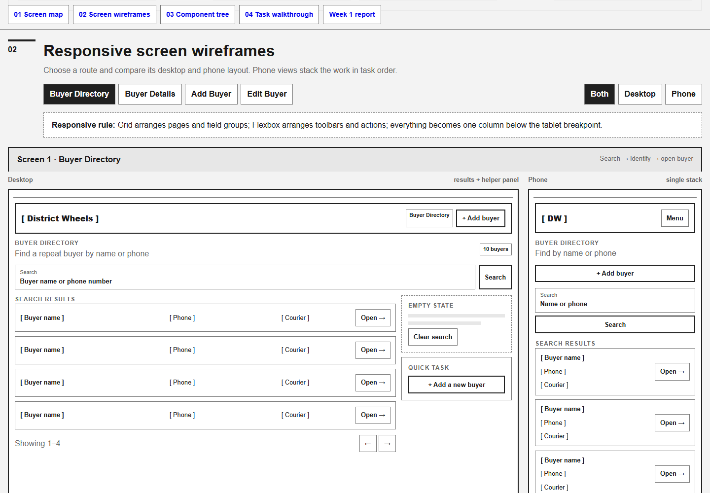
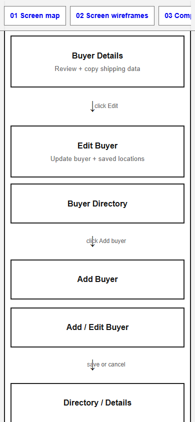

# District Wheels Dispatch Directory

## Submission link

[Open the published documentation on GitHub](https://github.com/H1R0000/District-Wheels-Dispatch-Directory/blob/main/README.md)

## 1. Overview

District Wheels Dispatch Directory is a planned fulfillment tool for the District Wheels fulfillment manager. It will help the manager find a repeat buyer and copy saved shipping information into LBC or J&T Express forms with fewer repeated lookups and typing errors.

The current Week 1 increment is written project documentation. It covers the four planned screens, component architecture, primary task flow, responsive behavior, and design system before the React, Express, and PostgreSQL implementation begins.

## 2. Setup and installation

### Prerequisites

No application setup or dependency installation is required. The repository currently contains documentation only. Git is optional and is needed only if you want a local copy.

### Get the code

1. Clone the public GitHub repository:

   ```bash
   git clone https://github.com/H1R0000/District-Wheels-Dispatch-Directory.git
   ```

2. Enter the project directory:

   ```bash
   cd DCW_Dispatch_Directory
   ```

### Install dependencies

There are no dependencies to install. Markdown files can be read directly on GitHub, while the exported PDFs and images can be opened with their usual viewers.

### Environment and configuration

The current prototype requires no environment variables, secrets, or external services.

Do not add real buyer records or courier credentials to the repository. The finished application will use placeholder values in an `.env.example` file and keep real secrets in an untracked `.env` file.

### Set up and seed the database

There is no database to create, migrate, or seed in the Week 1 increment. The planned PostgreSQL database will be added later and seeded only with fictional buyer and shipping data. This section will be updated with exact migration and seed commands when the database exists.

## 3. How to view it

Open this README on GitHub, then use the links under **Supporting files** to read the proposal, wireframe documentation, increment report, and exported PDFs. No local server is required.

## 4. Features and usage

### Screen map

The screen map documents the intended navigation among:

- Buyer Directory
- Buyer Details
- Add Buyer
- Edit Buyer

It also shows where the user returns after saving or canceling a buyer form.

### Responsive screen wireframes

Open the wireframe documentation or PDF to review the Buyer Directory, Buyer Details, Add Buyer, and Edit Buyer layouts at desktop and phone sizes. Search, save, edit, delete, and copy actions shown in the wireframes are planned features rather than working controls.

### Component architecture

Open the wireframe documentation to review:

- Page-level components for the four screens.
- Organisms such as `AppHeader` and `LocationDialog`.
- Molecules such as `SearchBar`, `BuyerCard`, and `CopyField`.
- Atoms such as buttons, inputs, tags, and feedback text.

The atomic-design table records where each component appears and the props it is expected to receive.

### Task walkthrough

Use the task-flow section of the wireframe documentation to follow the primary fulfillment flow:

1. Search for a repeat buyer.
2. Open the buyer record.
3. Choose the shipping method.
4. Select a saved address or LBC pickup location.
5. Copy the required values.
6. Paste them into the external courier form.

### Current endpoints

The Week 1 prototype has no API endpoints. Planned Express routes will cover buyers, addresses, LBC pickup locations, and couriers after the database is implemented.

## 5. Project structure

```text
DCW_Dispatch_Directory/
|-- docs/
|   |-- images/             # README screenshots
|   |-- pdf/                # Exported wireframe and design-system PDFs
|   |-- proposal.md         # Project proposal
|   |-- wireframes.md       # Detailed wireframe documentation
|   `-- week-1-increment-report.md
`-- README.md               # Project documentation
```

## 6. Screenshots

### Desktop wireframe comparison



### Phone layout



## 7. Known issues and next steps

### Known issues

- The project currently contains planning documentation, not the finished dispatch application.
- Buyer records, addresses, pickup locations, and courier choices are placeholders.
- Search, copy, create, edit, delete, and save controls do not yet perform data operations.
- The database rule that allows only one default address and one default LBC pickup location per buyer is designed but not implemented or tested.

### Next steps

- Build the four screens as React routes and reusable components.
- Create the Node/Express REST API.
- Add PostgreSQL migrations and fictional seed data.
- Implement search and buyer CRUD operations.
- Add address and LBC pickup-location management.
- Add clipboard actions and text-based success or failure feedback.
- Add validation, database transactions, and useful loading, empty, and error states.
- Test responsive layouts, keyboard operation, and accessibility.
- Document the final environment variables, database commands, and API endpoints when those features are implemented.

## Supporting files

- [Project proposal](docs/proposal.md)
- [Week 1 increment report](docs/week-1-increment-report.md)
- [Wireframe documentation](docs/wireframes.md)
- [Wireframe PDF](docs/pdf/District-Wheels-Wireframes.pdf)
- [Design-system PDF](docs/pdf/District-Wheels-Design-System.pdf)
