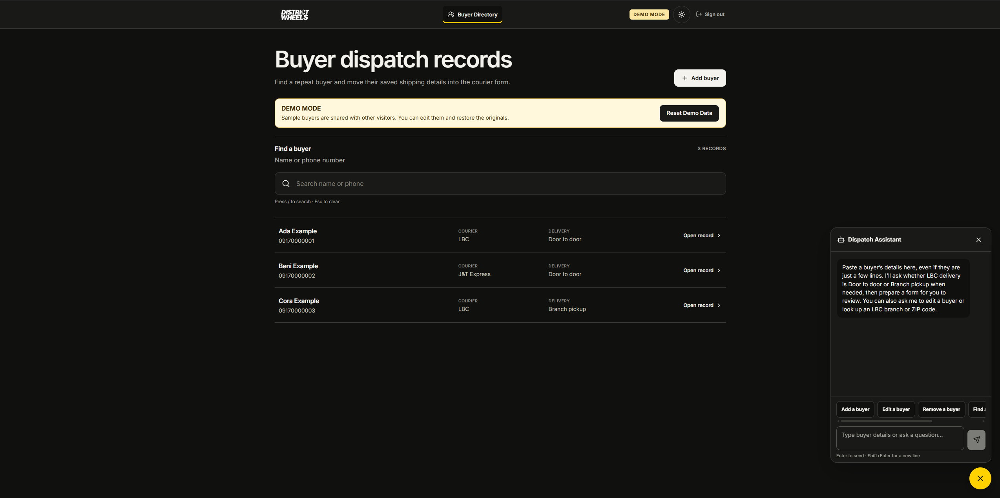
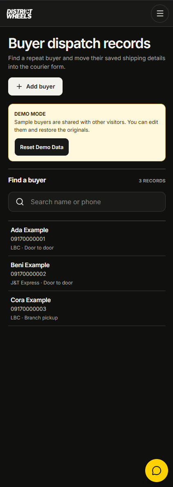

# District Wheels Dispatch Directory

[](AI-USAGE.md)

I designed and directed the project, built the first working website, and wrote the earlier buyer sorting and phone-handling changes. Codex built much of the later feature code and helped polish and debug it; see [AI usage and authorship](AI-USAGE.md).

## 1. Overview

District Wheels Dispatch Directory helps a fulfillment manager find repeat buyers and copy saved shipping details into LBC or J&T Express forms. The Week 1 proposal and wireframes have since become a React application with buyer records, courier-specific locations, authentication, and a fictional-data demo.

The browser app uses Supabase Auth, Database, and Edge Functions. An Express API and JSON or PostgreSQL store remain in the repository for explicit local development and tests; the browser's buyer operations use Supabase directly.

## 2. Setup and installation

### Prerequisites

- Node.js and npm compatible with the versions in `package-lock.json`.
- Access to a configured Supabase project for the browser app. The project must have the migrations, approved user profiles, Auth settings, and Edge Functions described in [demo and owner rollout](docs/demo-owner-rollout.md).
- PostgreSQL only if using the optional Express API with `DATABASE_URL`. Without it, the server uses an ignored local JSON file.

### Get the code and install dependencies

```bash
git clone https://github.com/H1R0000/District-Wheels-Dispatch-Directory.git
cd District-Wheels-Dispatch-Directory
npm ci
```

### Configure the browser app

Copy `client/.env.example` to an untracked `client/.env.local` and fill in the Supabase project's public browser values (Vite's root is `client/`):

```dotenv
VITE_SUPABASE_URL=https://YOUR_PROJECT.supabase.co
VITE_SUPABASE_PUBLISHABLE_KEY=YOUR_PUBLISHABLE_KEY
```

These values are required: the sign-in screen fails closed when either is missing. Keep service-role keys, demo credentials, and other secrets out of `VITE_` variables and source control. The demo and assistant require their deployed Edge Functions and server-side secrets; `.env` alone does not create a working Supabase project.

### Run locally

```bash
npm run dev:client
```

Open `http://localhost:5173`. Use **Sign in with GitHub** for the approved owner account or **Enter demo** for fictional records when the configured backend supports those flows.

`npm run dev` starts both Vite and Express. Express listens on port `3000` by default, but its legacy buyer endpoints are disabled unless `ENABLE_LEGACY_API=true` is set explicitly. Set `DATABASE_URL` to use PostgreSQL; otherwise the optional API stores data in `data/dev-db.json`. Do not put real buyer data in this local development store.

### Database setup

The browser app depends on the SQL files in `supabase/migrations/`, applied in order to a project with the required Auth configuration. These migrations include buyer and location tables, row-level access policies, demo access, assistant lookups, backup and deletion functions, and atomic buyer save/delete RPCs. The existing hosted project has older migration-history timestamps for some files, so inspect its history before running `supabase db push`; do not blindly replay the files against that project. The repository does not contain a one-command seed for a fresh Supabase project; demo setup requires the administrator steps in [demo and owner rollout](docs/demo-owner-rollout.md).

The optional Express/PostgreSQL path initializes `db/migrations/001_initial.sql` when `DATABASE_URL` is set. It is separate from the Supabase schema.

## 3. Features and usage

### Main workflow

1. Search the Buyer Directory by name or phone number.
2. Open a buyer record and review the preferred courier, saved delivery addresses, or LBC pickup locations.
3. Copy the needed fields and paste them into the courier's external form.
4. Use Add Buyer or Edit Buyer to maintain records. The form validates courier-specific location details.

The four browser routes are `/`, `/buyers/new`, `/buyers/:buyerId`, and `/buyers/:buyerId/edit`. The interface includes a dispatch assistant that can prepare a buyer draft for review and help resolve LBC branch details. Review suggested details before saving them. Buyer saves and deletes run in single database transactions, including their audit records.

The demo uses fictional records and is isolated from the owner's records. It can be reset where the deployed demo functions are available. Access is controlled by approved Supabase profiles and database policies, not just by the sign-in screen.

### Demo screenshots





### Optional Express endpoints

When `ENABLE_LEGACY_API=true`, the local API provides:

| Method | Path | Purpose |
| --- | --- | --- |
| `GET` | `/api/health` | Health check; available without enabling buyer endpoints. |
| `GET` | `/api/buyers?q=...` | Search buyers. |
| `GET` | `/api/buyers/:buyerId` | Read one buyer. |
| `POST` | `/api/buyers` | Create a buyer. |
| `PUT` | `/api/buyers/:buyerId` | Replace a buyer's details. |
| `DELETE` | `/api/buyers/:buyerId` | Delete a buyer. |

The legacy buyer API has no Supabase user context. Keep it disabled for public or production access.

## 4. Project structure

```text
client/                  React pages, components, styles, and Vite config
server/                  Optional Express API and JSON/PostgreSQL stores
db/migrations/           Optional Express/PostgreSQL schema
supabase/migrations/     Browser app database schema and access policies
supabase/functions/      Demo, reset, and dispatch assistant functions
test/                    API and utility tests
docs/                    Proposal, wireframes, PDFs, and rollout notes
images/                  District Wheels assets
```

## 5. Tests and build

```bash
npm test
npm run build
```

On September 26, 2026, all 38 local tests and the production build passed. The build script uses Vite's runner config loader to work in the restricted Windows workspace.

## 6. Deploy to Vercel

**Live deployment (September 26, 2026):** [District Wheels Dispatch Directory](https://district-wheels-dispatch-directory.vercel.app) from commit `ded43fa` (deployment `dpl_7AWffWiYn5JzCvPbc4BGH7RJn2ea`). The production site passed mobile demo sign-in, direct `/buyers/new` refresh, assistant draft preparation with an official LBC branch match, and demo buyer create, edit, and delete. The test record was removed. The production origin is configured in Supabase Auth and the three Edge Functions. Automatic GitHub deployments need the Vercel account's GitHub login connection; the CLI deployment is live and repeatable meanwhile.

The root [`vercel.json`](vercel.json) builds the Vite app with `npm run build`, serves `client/dist`, and rewrites direct React route requests to `index.html`. The optional Express server is not part of the Vercel deployment.

1. Create a Vercel project from this GitHub repository with the repository root as its root directory.
2. Set `VITE_SUPABASE_URL` and `VITE_SUPABASE_PUBLISHABLE_KEY` in the Vercel project for Preview and Production. They are browser values. Never add a service-role key, demo password, or assistant API secret to a `VITE_` variable.
3. Deploy Preview. Add its exact origin to the Supabase Edge Function `APP_ORIGINS` secret if the demo or assistant will be tested there. Add the Preview callback URL to Supabase Auth redirect URLs when testing GitHub sign-in.
4. After preview checks pass, deploy Production. Set the Supabase Auth Site URL and an exact allowed redirect URL for the production origin; add that origin to `APP_ORIGINS`. Redeploy affected Edge Functions after changing their secret when required by the platform.
5. Test a fresh browser session, a direct refresh of `/buyers/new` and a buyer detail route, GitHub sign-in, the demo, and the dispatch workflow.

See [demo and owner rollout](docs/demo-owner-rollout.md) for Supabase setup and release checks.

## 7. Known limits

- The assistant and demo require deployed Supabase Edge Functions and configured secrets. A local build alone cannot verify them.
- Demo records are shared by visitors and may be reset. Do not enter real buyer information in demo mode.
- The optional Express buyer API has no browser user context and stays disabled unless explicitly enabled for local development.

## Supporting files

- [Project proposal](docs/proposal.md)
- [Week 1 increment report](docs/week-1-increment-report.md)
- [Week 2 increment report](docs/REPORT_2.md)
- [Wireframe documentation](docs/wireframes.md)
- [Wireframe PDF](docs/pdf/District-Wheels-Wireframes.pdf)
- [Design-system PDF](docs/pdf/District-Wheels-Design-System.pdf)
- [Demo and owner rollout](docs/demo-owner-rollout.md)
